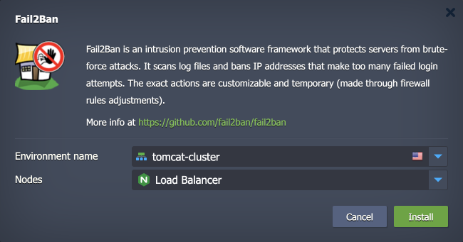

 

# Fail2Ban Add-on

This repository provides a [Fail2Ban](https://github.com/fail2ban/fail2ban) add-on for the Virtuozzo Application Platform (VAP) environments. The add-on is designed to be deployed on the VAP platform and provides an easy way to set up and manage Fail2Ban, an intrusion prevention software framework that protects servers from brute-force attacks. Written in the Python programming language, it can run on POSIX systems that have an interface to a packet-control system or firewall installed locally, for example, iptables or TCP Wrapper.

The add-on can be applied to the following types of nodes:

- Application Server (cp)
- Load Balancing (bl)
- Database Server (db)

## Fail2Ban Add-On Specifics

This package automatically installs the Fail2Ban solution for the specified nodes in the Virtuozzo Application Platform environment. The add-on allows you to set up an intrusion prevention software framework that protects servers from brute-force attacks and updates firewall rules to reject IP addresses for a specified amount of time.

Fail2ban operates by monitoring log files (e.g., `/var/log/auth.log` and `/var/log/apache/access.log`) for selected entries and running scripts based on them. Most commonly this is used to block selected IP addresses that may belong to hosts that are trying to breach the system's security. It can ban any host IP address that makes too many login attempts or performs any other unwanted action within a time frame defined by the administrator. Fail2ban is typically set up to unban a blocked host within a certain period, so as to not "lock out" any genuine connections that may have been temporarily misconfigured. However, an unban time of several minutes is usually enough to stop a network connection from being flooded by malicious connections, as well as reduce the likelihood of a successful dictionary attack.

Fail2ban can perform multiple actions whenever an abusive IP address is detected:

- update netfilter/iptables or PF firewall rules
- update TCP Wrapper's hosts.deny table to reject an abuser's IP address
- send email notifications
- run any user-defined actions that can be carried out via a Python script

The standard configuration ships with filters for Apache, Lighttpd, sshd, vsftpd, qmail, Postfix, and Courier Mail Server. Filters are defined by Python regexes, which may be conveniently customized by an administrator familiar with regular expressions. A combination of these filters and actions is known as "jail", as it causes a malicious host to be blocked from accessing specified network services. A "jail" may be created for any network-facing process that creates a log file of access.

At the add-on's menu, the "Remove the IP from the Ban list" option can be selected to remove the banned IP from the jail list.

## Deployment to Cloud

To get your Fail2Ban add-on, click the "**Deploy to Cloud**" button below, specify your email address within the widget, choose one of the [Virtuozzo Public Cloud Providers](https://www.virtuozzo.com/application-platform-partners/), and confirm by clicking **Install**.

> To install the add-on from the Virtuozzo Application Platform (VAP) dashboard, you need to [import](https://www.virtuozzo.com/application-platform-docs/environment-import/) a manifest file from this repository.

## Installation Process

In the opened installation window at the VAP dashboard, choose a target environment and nodes to which the add-on will be applied. Click **Install** to start the installation process.

Your Fail2Ban add-on will be automatically installed in a few minutes.
